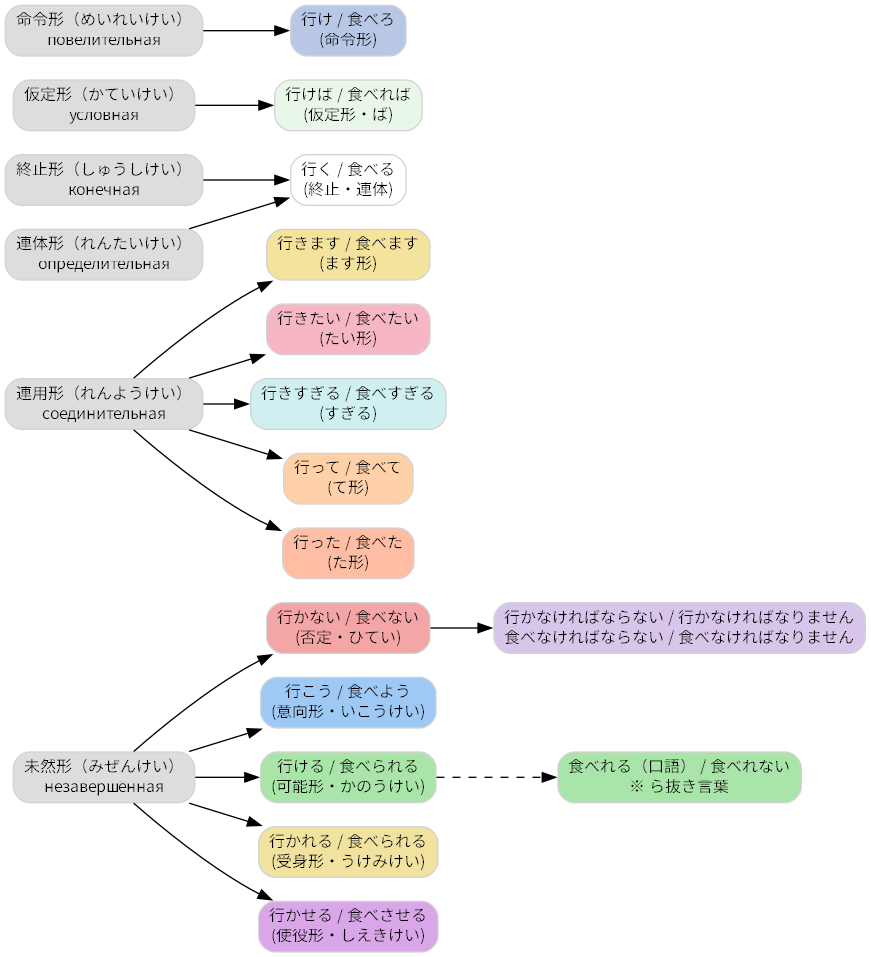

---
hide:
  - navigation
---

# Глаголы

## Спряжение глаголов (行く/食べる)

<!-- SVG с тултипами (HTML допускается). Дай явную высоту! -->
<object data="diagrams/conjugation.svg" type="image/svg+xml" width="70%" height="520"></object>

_Статичное изображение (fallback, без подсказок):_

